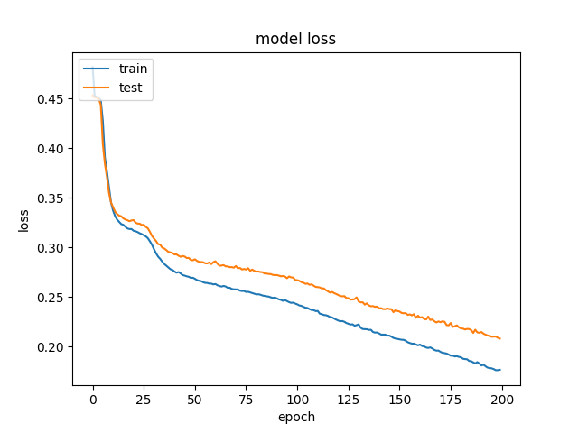
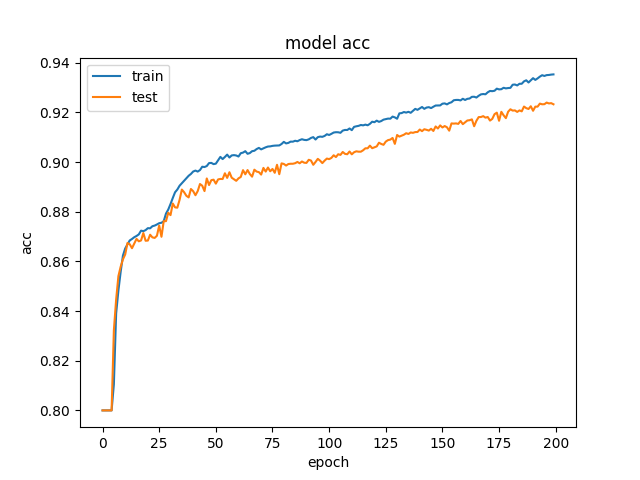
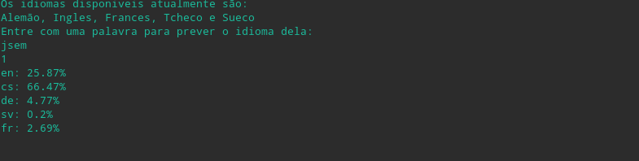
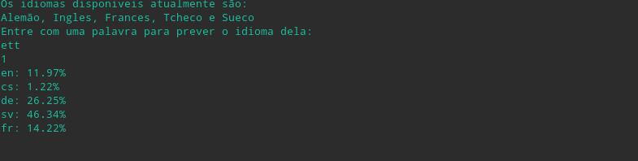
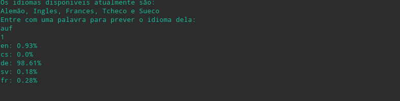
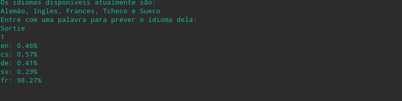

# Classificador de linguagem
A proposta deste projeto consistem em criar um classificador de linguagem capaz de definir o idioma de uma palavra com até 12 caracteres.

Para a construção da solução proposta foram divididos e executados os seguintes passos:

## Obtenção do dataset
A etapa de obtenção de dataset consiste na definição dos idiomas a serem tratados e obtenção do banco de palavras que caracterizam cada um dos idiomas escolhidos.
### Definição dos idiomas e temas
A escolha de idiomas se deu baseado em pesquisa de sistemas similares que identificaram que essas línguas têm diferenças marcantes, facilitando a classificação entre elas. No caso:
* Francês
* Inglês
* Checo
* Alemão
* Sueco

Além disso foi construída uma lista de palavras para cada uma das linguagens, que seriam as chaves de busca.

### Raspagem dos dados
A construção do dataset após a seleção dos idiomas se deu por meio da api da Wikipedia, onde foram raspadas todas as palavras, que se encaixavam no número máximo de caracteres, dos artigos relacionados as chaves de busca selecionadas para cada língua. Todo esse processo utilizando técnicas de Web Scraping.

## Construção da rede
Dada a complexidade da classificação das palavras foi utilizada uma rede neural profunda para a realização da tarefa. A linguagem utilizada foi o Python em conjunto com as bibliotecas Keras para tudo que diz respeito a rede neural, Scikit Learn para a repartição do dataset, pandas para a manipulação do dataset e numpy para conversão dos dados.

A divisão dos datasets consiste em:
* 85% para treino
* 15% para validação

Foi utilizada uma rede sequencial, também chamada de feedforward network, com quatro hidden layers com respectivamente:
* 200 nós
* 150 nós
* 100 nós
* 100 nós

O número de camadas e nos é justificado pela complexidade do problema.
As camadas internas utilizam uma função sigmoid de ativação, enquanto que a camada de saída softmax. Além disso foi utilizada uma taxa de aprendizado adaptativa, o Adam optimiser, e a função de perda binary cross entropy.

## Treinamento

Foram utilizadas 200 epochs para o treinamento do modelo com um batch de tamanho 100. Abaixo os gráficos da acurácia e perda ao longo das epochs:

* Loss

* Accuracy

## Resultados
Foram utilizadas algumas palvras de teste para demonstrar a eficiência do classificador.

* Hi ("Oi" em inglês)

* Jsen ("Eu sou" em tcheco)

* Ett ("Um" em Sueco)

* Guten ("Bom" em Alemão)

* Sortie ("Saída" em Frances)

